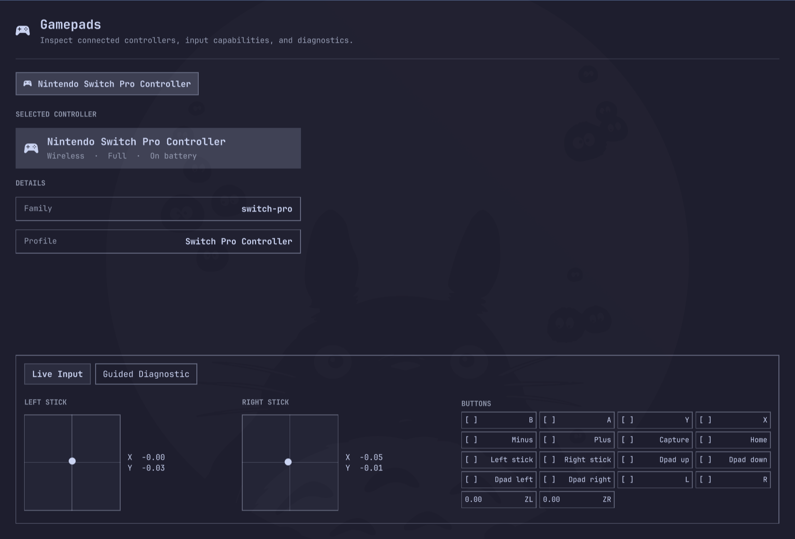
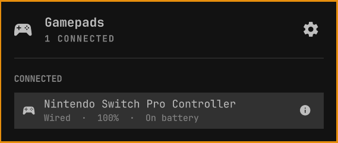
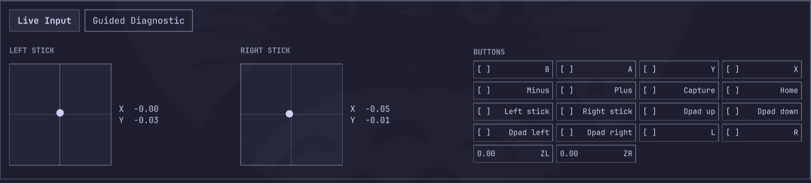
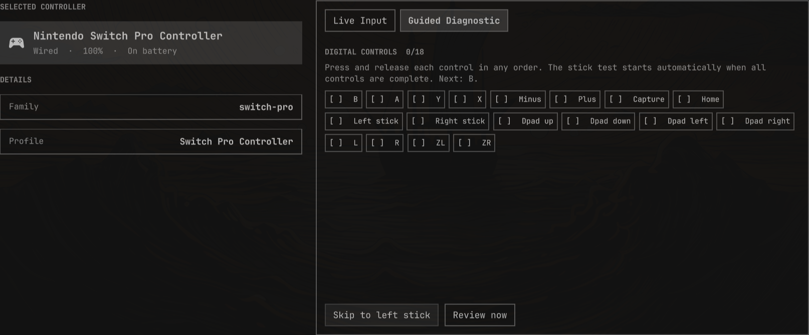
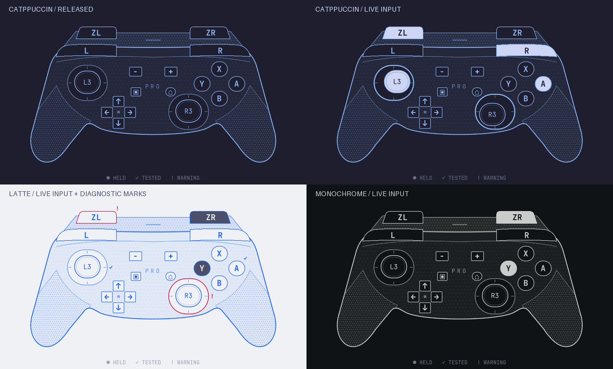

# Omarchy Gamepads

Controller vitals, live input, and guided diagnostics in the Omarchy shell.



Omarchy Gamepads adds a native bar widget, compact controller overview, and
keyboard-friendly Details window. Version 1 focuses on reliable Nintendo
Switch Pro Controller diagnostics without root services, exclusive input grabs,
or persistent hardware identifiers.

## Features

- View up to 32 concurrently connected SDL-recognized controllers from one native Omarchy bar widget.
- Inspect connection, battery, capabilities, buttons, triggers, and stick input.
- Follow Switch Pro input on a theme-aware, dithered 2D controller schematic.
- Run guided Switch Pro checks over USB or Bluetooth.
- Review passed, warning, not detected, incomplete, and unavailable results.
- Retry individual controls without restarting the complete diagnostic.
- Export explicit, privacy-filtered JSON and Markdown reports.
- Navigate the complete Details workflow without a mouse.
- Keep multiple controllers and hotplug changes isolated by connection session.

| Compact overview | Live input | Guided diagnostic |
| --- | --- | --- |
|  |  |  |

## Install

Plugins run as unsandboxed code inside the long-running `omarchy-shell`
process. Review third-party plugin code before installing or updating it.

Install the SDL3 Python bindings from the official Arch repository:

```bash
omarchy pkg add python-pysdl3
```

Add and enable the plugin:

```bash
omarchy plugin add https://github.com/lightqv/omarchy-gamepads.git --enable
```

The widget appears in the right bar section by default. Move it with:

```bash
omarchy bar move lightqv.gamepads --section right
```

## Use

Select the gamepad icon in the bar for compact controller status. Choose
**Details** for live input and guided diagnostics, or summon Details directly:

```bash
omarchy-shell shell summon lightqv.gamepads
```

### Keyboard

| Key | Action |
| --- | --- |
| `Tab` / `Shift+Tab` | Cycle controllers |
| Arrows or `h` / `j` / `k` / `l` | Move through modes, retry targets, and actions |
| `Enter` / `Space` | Activate the selected action |
| `PageUp` / `PageDown` | Scroll the visible overflowing section |
| `Home` / `End` | Move to the start or end of the visible section |
| `Escape` | Close Details or confirm ending an active diagnostic |

Controller selection stays locked while a diagnostic is active so results
remain attached to the controller that started the session.

### Controller Schematic

The development version adds a fixed front/above Switch Pro diagram with visible
L/R and ZL/ZR, accent-colored contours, dithered grips, and monospace labels.
It follows the active Omarchy theme automatically.

- Held controls use a filled highlight and inverted label; release restores the outline.
- Stick caps follow movement, while L3/R3 clicks highlight independently.
- In guided tests, `✓` marks a passed result and `!` marks a warning or undetected
  input. Stick-cap marks describe clicks; marks beside the outer rings describe
  movement checks. Results are scoped to the tested controller.
- Capture is `▣`, Home is `⌂`, and ZL/ZR use the same press threshold as Live Input.



The drawing uses ordinary Qt Quick 2D rendering supplied with Omarchy. It is a
live input indicator and does not send simulated inputs when clicked.

## Controller Support

Up to 32 concurrently connected controllers recognized by SDL receive generic
status and live-input views. The guided workflow currently has a detailed
profile for the Nintendo Switch Pro Controller.

The Switch Pro profile has been physically verified over USB and Bluetooth.
Diagnostic thresholds are intentionally conservative and report observations,
not hardware-failure conclusions.

The current schematic supports the Switch Pro profile. The previous 3D prototype
and modeling work are preserved in a verified external archive; see
[visual work recovery](docs/visual-work-archive.md).

## Requirements

- A current Omarchy installation with its Quickshell shell
- `python-pysdl3` from the official Arch repository
- An SDL-recognized gamepad

Version 1.0.0 was tested with Omarchy 4.0.2, Quickshell 0.3.1, Hyprland 0.56.2,
Python 3.14.7, PySDL3 0.9.11b1, and SDL 3.4.14. Omarchy is rolling software;
revalidate the plugin after major shell, SDL, or Hyprland upgrades.

## Reports And Privacy

The helper runs as the logged-in user and never uses exclusive input grabs. It
does not require root, broad input-group membership, or custom udev rules.

Reports are created only after selecting **Export report**. They omit session
IDs, serial numbers, Bluetooth addresses, device paths, usernames, home paths,
and unrelated controllers. Report directories use mode `0700`; report files
use mode `0600`.

Reports are stored under:

```text
~/.local/state/omarchy-gamepads/reports/
```

Removing the plugin intentionally leaves exported reports in place. Delete
that directory separately if the reports are no longer needed.

See [`docs/backend-protocol.md`](docs/backend-protocol.md) for the bounded NDJSON
protocol and [`docs/controller-profile.md`](docs/controller-profile.md) for the
profile contract.

## Troubleshooting

### Backend dependency unavailable

Install or reinstall `python-pysdl3`, then restart the shell:

```bash
omarchy pkg add python-pysdl3
omarchy restart shell
```

### Controller not shown

Confirm another application has not made the device unavailable, reconnect the
controller, and check whether SDL recognizes it. Steam Input may present a
different mapped controller while a game is running.

### Controller view unavailable

Other controller families keep their generic live input and vitals. If the
Switch Pro view cannot load, check shell diagnostics; the input and diagnostic
workflows are independent of the drawing.

### Details window does not appear correctly

Close Details and open it again on the intended workspace. The plugin uses the
focused monitor's usable logical area and requires the `hyprctl` and `jq` tools
included with Omarchy.

### Check shell diagnostics

```bash
quickshell log --tail 500 --no-color
```

Please redact unrelated usernames, paths, addresses, and device details before
sharing logs or reports publicly.

## Update Or Remove

```bash
omarchy plugin update lightqv.gamepads
omarchy plugin remove lightqv.gamepads
```

## Development

Run the local development checks from an Omarchy workstation with Qt QML
tooling, Node.js, and Python available:

```bash
omarchy plugin validate .
scripts/check-release-metadata.sh
scripts/lint-qml.sh
bash tests/test_window_placement.sh
node --test tests/*.test.js
python -B -m unittest discover -s tests -v
```

On an Omarchy workstation, also run the Quickshell lifecycle checks:

```bash
scripts/test-service.sh
scripts/test-panel.sh
scripts/test-schematic.sh
```

See [`CONTRIBUTING.md`](CONTRIBUTING.md) and
[`docs/release-checklist.md`](docs/release-checklist.md) before submitting a
change or preparing a release.

## Roadmap

Current visual development uses a compact 2D schematic alongside controller
status, live input, and guided diagnostics. Additional controller families can
add their own diagrams and diagnostic profiles. Previous geometry and material
progress can be resumed from the [external recovery archive](docs/visual-work-archive.md).

## License

[MIT](LICENSE)
